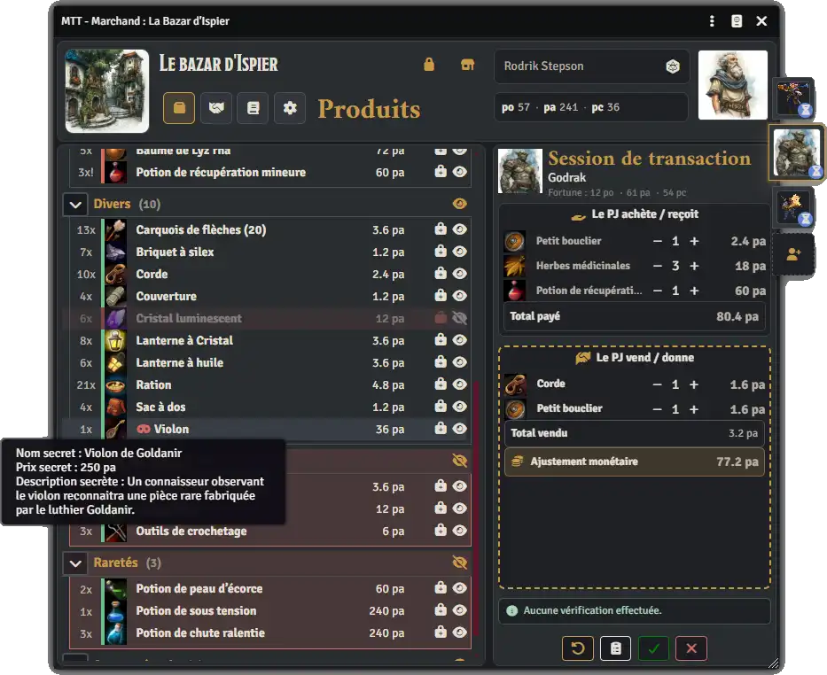
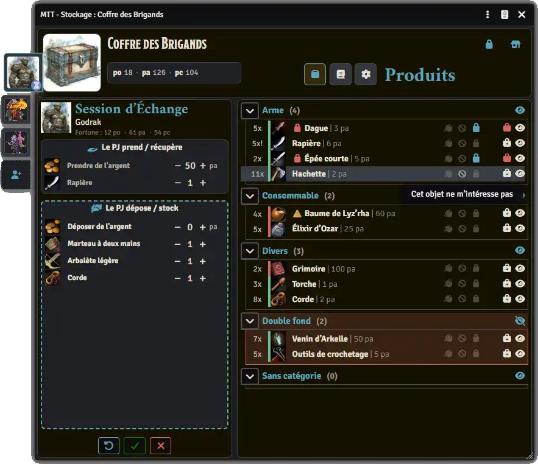

<h1>Merchants, Trades and Transactions</h1>

**Merchants, Trades and Transactions** (**MTT**) est un module pour **Foundry VTT** qui ajoute une gestion de marchands, boutiques, services et transactions.

Le module permet de créer deux types d'acteurs MTT : des marchands et des stockages.
Les marchands permettent de gérer un catalogue de produits et de services, les trier dans des catégories, modifier leurs informations (nom, prix, monnaies, quantité...), masquer/révéler chaque article ou catégorie...
Les stockages permettent de ranger des produits dans des catégories, récupérer ou déposer des objets et de la monnaie, ajouter des tags sur les objets, masquer/révéler un objet ou une catégorie...

MTT est pensé comme un module générique : il peut être configuré pour différents systèmes de jeu grâce à des chemins de données personnalisables et une configuration des monnaies.
La possibilité d'exporter et d'importer les options de configuration permet de partager les réglages d'un système de jeu facilement.

<p align="center">
   
</p>

<h2>Fonctionnalités principales</h2>
<ul>
<li>Conversion d’un acteur système normal en boutique ou en stockage MTT.</li>
<li>Catalogue de produits basé sur des Items Foundry.</li>
<li>Gestion de services dans la boutique.</li>
<li>Catégories et sous-catégories de catalogue.</li>
<li>Produits ou services visibles, masqués ou soumis à validation MJ.</li>
<li>Clients autorisés avec rail de portraits compact.</li>
<li>Sessions de transaction par client.</li>
<li>Achat de produits ou services.</li>
<li>Vente d’objets du PJ au marchand.</li>
<li>Ajustement monétaire automatique entre ce que le PJ reçoit et ce qu’il donne.</li>
<li>Prise en charge de plusieurs monnaies configurables.</li>
<li>Prix libres et propositions de prix.</li>
<li>Négociation manuelle par le MJ.</li>
<li>Validation ou refus d’une transaction complète.</li>
<li>Livraison des objets achetés sur l’acteur client.</li>
<li>Gestion des quantités, stocks et piles d’Items à la livraison.</li>
<li>Informations secrètes réservées au MJ.</li>
<li>Journal marchand et journal global des transactions.</li>
<li>Import/export de la configuration du module.</li>
</ul>

---

<h2>Compatibilité</h2>

MTT cible actuellement : **Foundry VTT V14**

Le module est développé pour rester indépendant d’un système de jeu précis.

Le premier environnement de test utilisé est **Chroniques Oubliées 2**, mais le cœur du module ne dépend pas directement de CO2.

---

<h2>Installation</h2>

<h3>Installation manuelle par URL de manifeste</h3>

Dans Foundry VTT :

<ol>
<li>1. Ouvrir **Configuration and Setup**.</li>
<li>Aller dans **Add-on Modules**.</li>
<li>Cliquer sur **Install Module**.</li>
<li>Coller l’URL du manifeste :</li>

```text
https://raw.githubusercontent.com/Alchimiste36/Foundry-Merchants-and-trade/main/module.json
```

<li>Installer puis activer le module dans le monde souhaité.</li>
</ol>

<h3>Installation manuelle par archive</h3>

<ol>
<li>Télécharger l’archive du dépôt.</li>
<li>Extraire le dossier du module dans le dossier `Data/modules` de Foundry.</li>
<li>Vérifier que le dossier du module contient bien `module.json`.</li>
<li>Redémarrer Foundry.</li>
<li>Activer le module dans le monde souhaité.</li>
</ol>

---

<h2>Configuration</h2>

MTT repose sur une configuration adaptable.

La configuration permet notamment de définir :

<ul>
<li>les types d’Items autorisés comme produits ;</li>
<li>les types d’Items autorisés comme services ;</li>
<li>les chemins de quantité ;</li>
<li>les chemins de description ;</li>
<li>les chemins de catégories et sous-catégories ;</li>
<li>les monnaies, abréviations et taux de conversion ;</li>
<li>les chemins de prix et de monnaie des Items ;</li>
<li>les chemins de monnaie des acteurs ;</li>
<li>les options de livraison et de fusion des Items ;</li>
<li>les permissions pour chaque droits de visibilité sur l'acteur MTT ;</li>
<li>les catégories personnalisées pour les Boutiques et pour les Stockage ;</li>
<li>d'exporter ou d'importer les options de configuration afin de les partager avec d'autres MJ ou de configurer le module rapidement dans un nouveau monde.</li>
</ul>

Cette configuration permet d’adapter le module à plusieurs systèmes de jeu sans coder de logique système directement dans le cœur de MTT.

---

<h2>Les Boutiques MTT</h2>
<p align="center">
  
</p>

Les acteurs convertis en Boutique permettent de simuler un marchand, un magasin, une échope... pour votre système de jeu. Les sessions de transactions permettent d'acheter, de vendre, de proposer un prix, de négocier... avec le marchand. Il reste uniquement après à valider ou refuser la session de transaction.

<h3>Création d'une boutique MTT :</h3>

<ul>
<li>Le MJ converti un acteur autorisé en Boutique MTT</li>
<li>il modifie le nom de la boutique, son image, le nom du marchand et son image</li>
</ul>

Dans les onglets Produits et Services :

<ul>
<li>il ajoute par glisser-déposer des Objets de Foundry dans le cataloque des produits et des services</li>
<li>il ajuste les quantités pour chaque produit</li>
<li>il détermine si les clients voient l'objet en mode limité ou observateur</li>
<li>il ajoute (si besoin) des informations secrètes</li>
<li>il modifie le nom, l'image ou le prix des produits</li>
<li>il ajoute des catégories personnalisées</li>
<li>il déplace par glisser-déposer les produits dans des catégories</li>
<li>il masque ou révèle les produits, les services ou les catégories pour les clients</li>
<li>il ajoute une demande d'approbation pour certain produits au besoin</li>
</ul>

Dans l'onglet Configuration :

<ul>
<li>le MJ écrit un description de la boutique et du marchand</li>
<li>il détermine les pourcentages de vente et d'achat généraux de la boutique par rapport aux prix initiaux des objets</li>
<li>il ajoute une formule pour le jet de négociation du marchand ( exemple : /roll 1d20+8 )</li>
<li>il ajuste la trésorerie de la boutique</li>
<li>et enfin, il peut enregistrer l'état de la boutique quand il a terminé pour réinitialiser la boutique facilement.</li>
</ul>

<h3>Session de transaction :</h3>

Grâce au rail des clients, le MJ peut ajouter des acteurs sur la boutique et leur ouvrir une session de transaction. En fonction des permissions pour chaque droit sur la boutique, les joueurs pourront :

<ul>
<li>ajouter des produits et des services du marchand vers leur session de transaction</li>
<li>ajouter des objets de leurs inventaires dans la session</li>
<li>modifier le prix de vente ou d'achat des produits et des services ajoutés à leur session pour déclencher une négociation</li>
<li>ajuster les quantités vendues ou achetées depuis leur session de transaction</li>
<li>visualiser la transaction</li>
<li>Soumettre sa session de transaction pour le MJ.</li>
</ul>

Quand une session de transaction est validée, les objets sont transférés du marchand vers le client et du client vers le marchand. Les objets qui sont achetés à la Boutique peuvent recevoir dans leurs descriptions une ligne d'informations pour savoir durant quelle transaction cet objet à été acheté et à qui. Les informations secrètes de l'objet pourront être écrit dans un champ spécifique de l'objet.

---

<h2>Les Stockages MTT</h2>
<p align="center">
  
</p>

Les acteurs convertis en Stockage MTT permettent de simuler un coffre trouvé dans un donjon, une réserve personnelle d'un personnage, un stockage commun pour le groupe de joueur, un butin récupéré sur un groupe d'ennemis... Les sessions d'Échange permettent de récupérer ou de déposer des objets ou de la trésorerie.

<h3>Création d'un Stockage MTT</h3>

<ul>
<li>Le MJ converti un acteur autorisé en Stockage MTT</li>
<li>il modifie le nom et l'image du stockage</li>
</ul>

Dans l'onglet Produits :

<ul>
<li>il ajoute par glisser-déposer des Objets Foundry autorisés</li>
<li>il modifie le nom, l'image ou le prix des Objets</li>
<li>il modifie la quantité de l'objet dans le stockage</li>
<li>il règle la visibilité de l'objet entre limité et observateur</li>
<li>il bloque certains objets afin d'en limiter leur récupération</li>
<li>il peut ajouter une option pour être averti lors de la récuépration d'un objet</li>
<li>il masque ou révèle les objets</li>
<li>il déplace par glisser-déposer des objets dans des catégories</li>
<li>il crée de nouvelles catégories personnalisées</li>
</ul>

Dans l'onglet Configuration :

<ul>
<li>il peut autoriser certains acteurs du rail à marchander avec une Boutique MTT au nom du stockage</li>
<li>il ajuste l'argent présent dans le stockage</li>
</ul>

<h3>Session d'Échange</h3>

Grâce au rail des clients, le MJ peut ajouter par glisser-déposer des acteurs qui pourront interagir avec le Stockage. Dans leur session d'Échange, les acteurs pourront récupérer des objets ou de la monnaie depuis le staockage et déposer des objets ou de la monnaie vers le stockage depuis leur inventaire par glisser-déposer.
La session d'Échange peut être soumise au MJ pour qu'il l'a valide ou la refuse.

---

<h2>Autres fonctionnalités</h2>

<h3>Journaux des Acteurs MTT et journaux globaux</h3>

Chaque transaction ou Échange validés ou réfusés est enregistré dans les journaux de transaction ou d'Échange sur la feuille de l'Acteur MTT et dans les journaux globaux des transactions ou des Échanges afin de filtrer et trier les sessions ayant été faites pour les Boutiques et les Stockages. Les journaux permettent de garder en mémoire qui a acheté/vendu/récupéré/déposé quoi à quelle Boutique et quel Stockage et de trier les sessions par acteurs, statut validée ou refusée, par prix total de la transaction...

<h3>Rail des acteurs</h3>

Sur le bord de la feuille d'un acteur MTT, un rail permet de gérer les "clients" pour la Boutique ou le Stockage.
En glissant-déposant un acteur autorisé sur la feuille MTT, il est ajouté au rail et le MJ peut ouvrir une session de transaction ou d'échange. Le MJ peut aussi retirer l'autorisation de l'acteur ou le supprimer du rail avec un clic droit sur l'image de l'acteur. Depuis le rail, le MJ peut aussi ouvrir rapidement la feuille de l'acteur et gérer des pourcentages personnalisés de chaque acteur.

<h3>Ouverture/fermeture</h3>

Une icône de l'entête permet d'autoriser ou de restreindre les transactions sur les Boutiques ou les Stockages. En fermant l'acteur MTT, les joueurs ne pourront plus interagir avec la Boutique ou le Stockage tant que le MJ n'aura pas "ouvert" l'acteur MTT.

<h3>Jet de négociation</h3>

Pour les Boutique MTT, le MJ peut facilement écrire un formule de jet de dé pour effectuer un jet de négociation envoyé dans le chat et ainsi estimer le marchandage du gérant de la boutique. Cette fonctionnalité permet au MJ de simuler très efficacement la négociation du marchand avec les clients.

<h2>Auteur</h2>

Module développé par **L'Alchimiste**. Vous pouvez me contacter sur Discord (l.alchimiste) ou via les issues du dépôt GitHub.
J'ai utilisé, en parti, les agents IA Codex de chatGPT et Claude Code pour le développement de ce module MTT.

<ul>
<li><a href="https://github.com/Alchimiste36/Foundry-Merchants-and-trade">Dépôt GitHub du projet</a></p></li>
<li><a href="https://www.youtube.com/@AlchimisteFoundry">Chaine YouTube Alchimiste Foundry</a></p></li>
<li><a href="https://ko-fi.com/lalchimiste">Pour m'offrir un petit café pour le travail effectué. Merci d'avance !</a></p></li>
</ul>

<p align="center">J'espère que ce module vous plaira et vous sera utile pour vos partie de JDR !</p>
<p align="center"><strong>Faites-moi des retours et des remarques sur vos expériences avec le module MTT afin que je puisse le corriger ou l'améliorer à l'avenir. Bonnes aventures à toutes et tous.</strong></p>

<p align="center">
  
</p>
